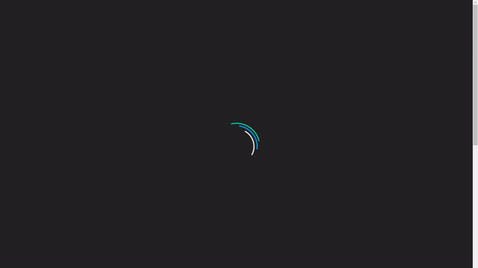

# MaanavD.github.io
Personal Website V4.0 - After three previous iterations, this is my current website. Created using Bulma with some additional bells and whistles.

## Installation

There's not much installation here! Just download the repo and double click the index.html

## Usage

Go to [MaanavDalal.com](https://maanavdalal.com)!

## Contributing
Pull requests are welcome. For major changes, please open an issue first to discuss what you would like to change.
At this time though, updates will more likely be 

## License
[MIT](https://choosealicense.com/licenses/mit/)